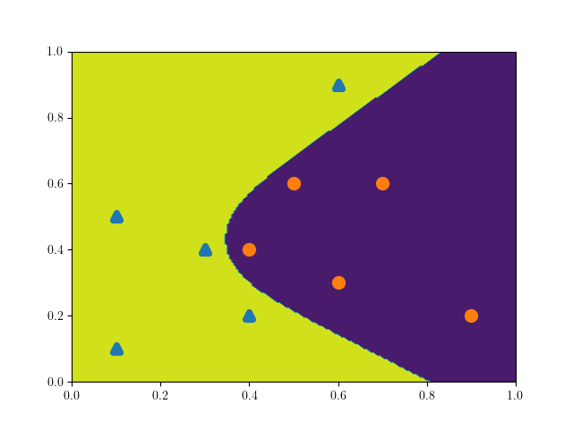
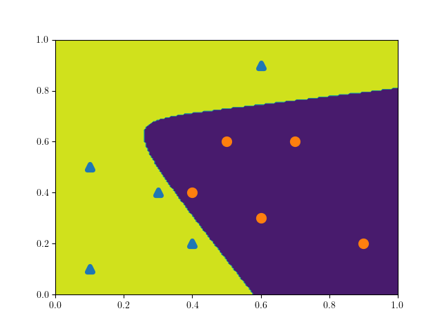
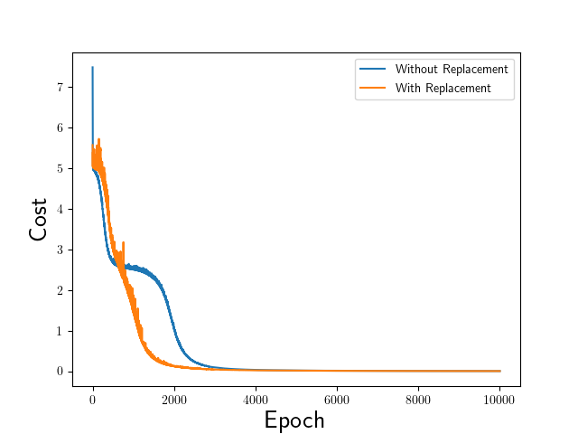
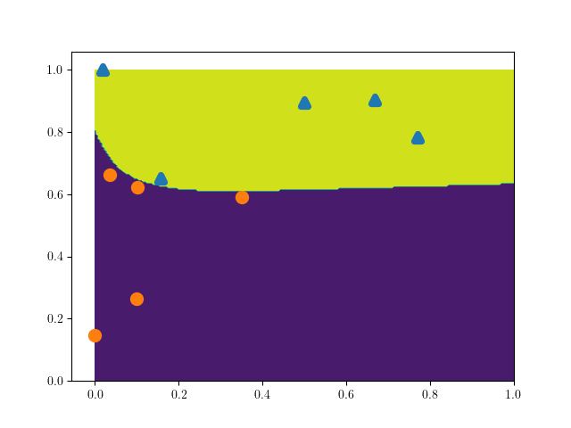
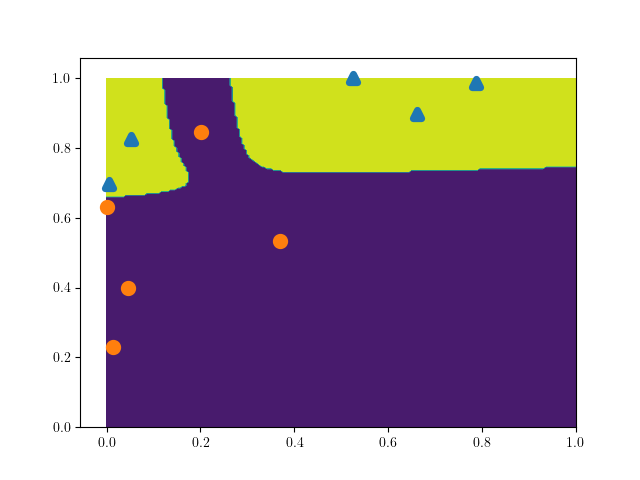
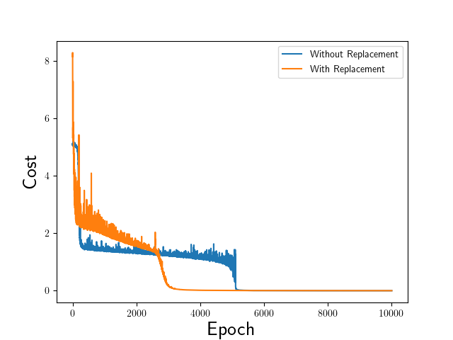

# Implementation of an artificial neural network
General artificial neural network (ANN) implemented in Python.

Currently implemented:
- Naive Implementation based on work in the [paper](https://epubs.siam.org/doi/pdf/10.1137/18M1165748).

- General Implementation of arbitrary neurons and arbitrary layers for a
classification problem involving noughts and crosses.

## Test Case

Here we test the code for an example case using the generalized code. Each epoch represents one loop over the training data, which is typically random. The random draws can be either be with replacement (chance of using same training data in the same epoch) or without replacement. We compare both in this example.

Run the code snippet:

```python

import ANN as N
from numpy.random import seed
from numpy import arange, mean
import matplotlib.pylab as plt

seed(1)

Network = N.GeneralNetwork(3, [2, 3, 2], verbose = 1, vis = False, \
                         activation_function = "sigmoid")
# define network architecture using GeneralNetwork object
Data_obj    = N.Data(10, highamdata = True)
# create data using Data object
cost1   = Network.train(Data_obj)


av_cost1 = [mean(cost1[i, :]) for i in arange(cost1.shape[0])]
# train the network with the data

Network = N.GeneralNetwork(3, [2, 20, 2], verbose = 1, vis = True, \
                         activation_function = "sigmoid")
# define network architecture using GeneralNetwork object
Data    = N.Data(10, highamdata = True)
# create data using Data object
cost2 = Network.train(Data, replacement = 1)
# train the network with the data
av_cost2 = [mean(cost2[i, :]) for i in arange(cost2.shape[0])]

import matplotlib.pylab as plt
# import plotting module
plt.plot(av_cost1)
plt.plot(av_cost2)
plt.legend(['Without Replacement', 'With Replacement'])
plt.xlabel(r'Epoch', fontsize = 20)
plt.ylabel(r'Cost', fontsize = 20)
plt.savefig('demonstration.png')
plt.show()
```

Output:

Higham data hyperplanes with replacement:




Higham data hyperplanes without replacement:




Cost comparison:



Generated data hyperplanes with replacement:




Generated data hyperplanes without replacement:



Cost comparison (though different data points):




Similar loss curves are found when running the naiveANN.py file, though this is for the "with replacement" case and is doing single step updates i.e. no pre-defined epochs.

## To Do

- Implement different loss functions (cross entropy)

- Generalize code so that inputs and outputs can be of any length for training

- Implement batch stochastic gradient descent and other optimizer techniques i.e. ADAM

- Add visualization of classifying the data points into categories

- Get ReLU and LeakyReLU working in gradient descent

#### References

Higham, C.F. and Higham, D.J., 2019. Deep learning: An introduction for applied mathematicians. SIAM Review, 61(4), pp.860-891.
